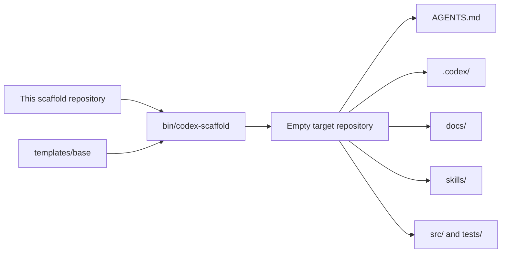
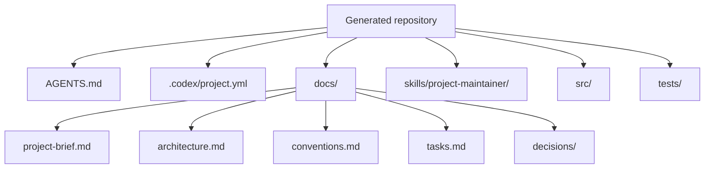
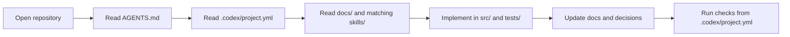

# Codex Project Scaffold

This repository is a base scaffold for making an empty repository Codex-ready.

It is the template source, not the project you build in day to day.

## What It Creates

- `AGENTS.md` for repository-specific operating rules
- `.codex/project.yml` for stable paths and commands
- `docs/` for long-lived project context
- `skills/` for repo-owned Codex skills
- empty `src/` and `tests/` roots

## Diagram: Source To Target



## Diagram: Generated Repository Shape



## Diagram: How Codex Uses It



## Structure

```text
.
|-- AGENTS.md
|-- bin/
|   `-- codex-scaffold
`-- templates/
    `-- base/
        |-- .codex/
        |-- docs/
        |-- skills/
        |-- src/
        `-- tests/
```

## How To Use It

Assume this scaffold repository is cloned at:

```text
/path/to/codex-project-scaffold
```

### Scaffold Another Empty Repository

```sh
FRAMEWORK=/path/to/codex-project-scaffold
"$FRAMEWORK/bin/codex-scaffold" /path/to/empty-repo --project-name my-service
```

### Scaffold The Current Directory

```sh
FRAMEWORK=/path/to/codex-project-scaffold
cd /path/to/empty-repo
"$FRAMEWORK/bin/codex-scaffold" . --project-name my-service
```

### Overwrite Existing Files

```sh
FRAMEWORK=/path/to/codex-project-scaffold
"$FRAMEWORK/bin/codex-scaffold" /path/to/repo --project-name my-service --force
```

### Show Help

From the scaffold source repository root:

```sh
./bin/codex-scaffold --help
```

## What Happens When You Run It

1. The script copies everything from `templates/base/` into the target repository.
2. It renders placeholders for `__PROJECT_NAME__` and `__PROJECT_SLUG__`.
3. The target repository is left with the base Codex operating structure.

## What Each Generated Part Is For

### `AGENTS.md`

Tells Codex how to work in the generated repository:

- what files to read first
- where code should live
- what docs must stay in sync
- when repo-owned skills should be used

### `.codex/project.yml`

This is the machine-readable repository index:

- source paths
- test paths
- docs paths
- skill paths
- setup, run, and test commands

You fill in the commands once the project runtime is chosen.

### `docs/`

This is the long-lived project context:

- `project-brief.md`
- `architecture.md`
- `conventions.md`
- `tasks.md`
- `decisions/`

### `skills/`

This is where repo-owned skills live.

The base scaffold includes `skills/project-maintainer/`, which gives Codex a local workflow for:

- scaffolding sparse repos
- keeping docs aligned with code
- maintaining repository coherence during implementation

### `src/` and `tests/`

These are empty starting points for code and tests. You can keep them or document a different layout later.

## Recommended Workflow After Scaffolding

1. Open the generated repository.
2. Fill in `docs/project-brief.md` with the real problem and goals.
3. Fill in `docs/architecture.md` with the first intended design.
4. Review `docs/conventions.md` and adjust it for the team.
5. Set `setup`, `run`, and `test` in `.codex/project.yml`.
6. Add any project-specific skills under `skills/`.
7. Ask Codex to implement the first real slice of the project.

## Example

```sh
mkdir -p /tmp/inventory-service
FRAMEWORK=/path/to/codex-project-scaffold
"$FRAMEWORK/bin/codex-scaffold" /tmp/inventory-service --project-name inventory-service
cd /tmp/inventory-service
```

At that point the repository is ready for Codex. A normal next prompt would be:

```text
Read AGENTS.md and the docs, then scaffold the first API slice for inventory items.
```

## Extending The Scaffold

### Add More Repo-Owned Skills

1. Add a folder under `templates/base/skills/<skill-name>/`.
2. Create `SKILL.md`.
3. Optionally add `agents/openai.yaml`.
4. Keep the skill concise and repository-specific.

### Extend The Base Template

Put shared files in `templates/base/` when every scaffolded repository should receive them.

## Optional Additions

This scaffold is intentionally minimal. Depending on the project, you may also want:

- CI workflows under `.github/workflows/`
- lint and formatting config
- `.env.example`
- container setup
- deployment docs
- runbooks
- additional repo-specific skills

## Verification

The scaffold has been verified to:

- print `--help`
- scaffold a base-only repository into a temporary directory
- preserve the repo-owned skill and docs structure in the generated repository
