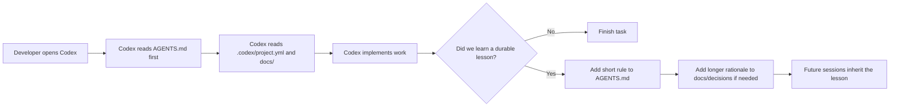
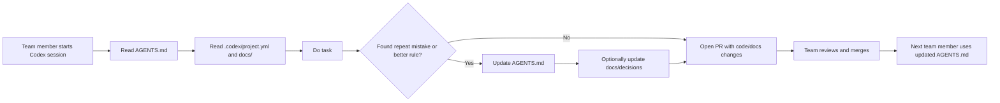
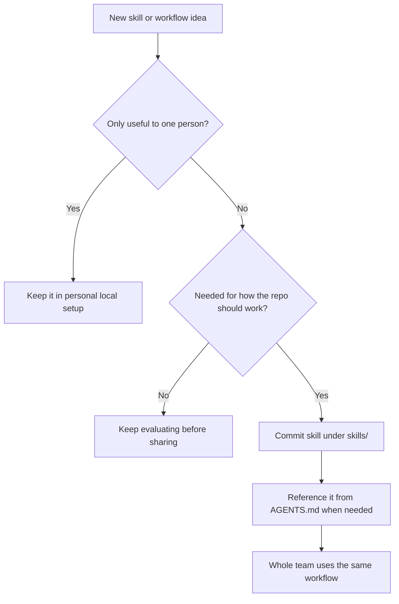
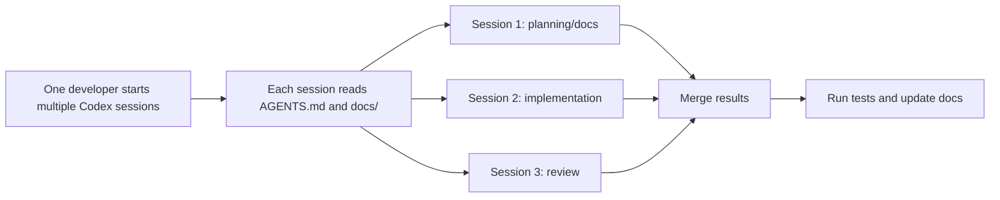
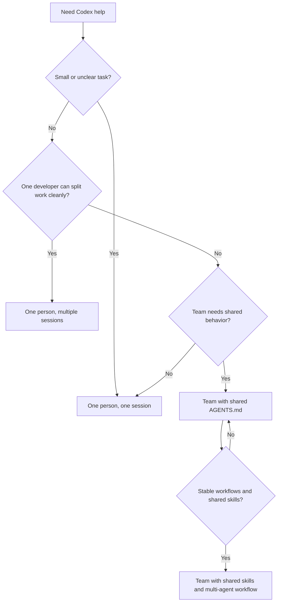
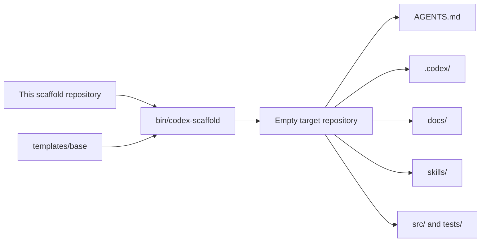
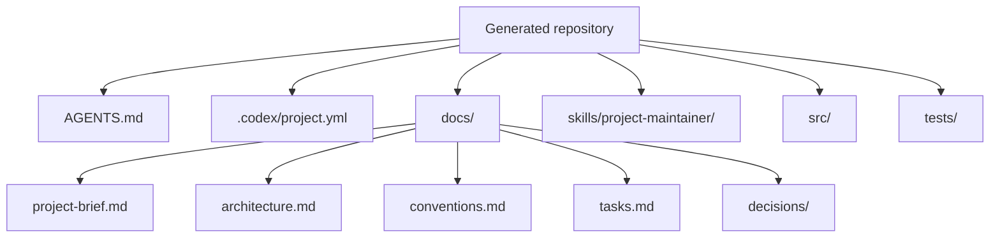
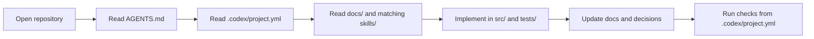

# Codex Project Scaffold

This repository is a base scaffold for making an empty repository Codex-ready.

It is the template source, not the project you build in day to day.

Use it when you want to start a new project in:

- an empty directory
- an already initialized empty Git repository
- a new directory that should be initialized as a Git repository during scaffolding

## Start Here

If you are new to this project, this is the shortest path:

```sh
FRAMEWORK=/path/to/codex-project-scaffold
"$FRAMEWORK/bin/codex-scaffold" /path/to/my-project --project-name "My Project" --git-init
cd /path/to/my-project
```

Then open the generated repository in Codex and start with:

```text
Read AGENTS.md, .codex/project.yml, and the docs folder. Then help me set up this project for the first feature.
```

## What This Creates

The scaffold creates:

- `AGENTS.md` for repository-specific operating rules
- `.codex/project.yml` for stable paths and commands
- `docs/` for long-lived project context
- `skills/` for repo-owned Codex skills
- empty `src/` and `tests/` roots

## Use It With Codex

The easiest mental model is:

- this scaffold prepares a repository for Codex
- you then open the generated repository and do the actual project work there

### Shared Rule: Use `AGENTS.md` As The Shared Codex Contract

Whether one person uses Codex or a whole team uses it, treat `AGENTS.md` as the single shared instruction set for every Codex session in the repository.

That means:

- every team member should tell Codex to read `AGENTS.md` first
- recurring mistakes should be turned into short rules in `AGENTS.md`
- team-wide preferred patterns should live in `AGENTS.md`
- longer explanations can live in `docs/decisions/`, but the operational rule should still be summarized in `AGENTS.md`

The goal is that one person's mistake becomes a rule that helps the whole team next time.

### Shared Starter Prompt

This is a good default prompt for everyone:

```text
Read AGENTS.md first and follow it. If you find a recurring mistake or a team rule that should be shared, propose an update to AGENTS.md before finishing.
```

### Shared Knowledge Flow



## One Person Using Codex

This is the simplest mode and the best place to start.

### First-Time Workflow

1. Create a new project folder or empty Git repository.
2. Run this scaffold into that target.
3. Open the generated repository in Codex.
4. Ask Codex to read the repo instructions and docs first.
5. Fill in the project brief and architecture.
6. Set the real `setup`, `run`, and `test` commands in `.codex/project.yml`.
7. Start giving Codex real implementation tasks.

### What To Fill In After Scaffolding

These are the first files you should update:

- `docs/project-brief.md`
- `docs/architecture.md`
- `docs/conventions.md`
- `docs/tasks.md`
- `.codex/project.yml`

### How Codex Should Work In The Generated Repo

Codex should usually work in this order:

1. Read `AGENTS.md`.
2. Read `.codex/project.yml`.
3. Read `docs/project-brief.md`, `docs/architecture.md`, `docs/conventions.md`, and `docs/tasks.md`.
4. Use matching repo-owned skills from `skills/` when relevant.
5. Implement code in `src/` and tests in `tests/`.
6. Update docs when the project changes.

### What You Need To Maintain Over Time

To keep Codex effective, keep these current:

- `docs/project-brief.md`
- `docs/architecture.md`
- `docs/tasks.md`
- `.codex/project.yml`
- any repo-specific skills in `skills/`
- `AGENTS.md` whenever the team learns a durable new rule

## A Team Using Codex

If multiple developers use Codex in the same repository, the team needs one shared operating model.

### What The Team Should Standardize

- everyone tells Codex to read `AGENTS.md` first
- everyone uses the same `docs/` and `.codex/project.yml` as the source of truth
- recurring mistakes get turned into short rules in `AGENTS.md`
- longer explanations go into `docs/decisions/`
- repo-wide shared skills are committed into `skills/`

### Good Team Process

1. Keep `AGENTS.md` short and operational.
2. Add rules only when they are durable and team-wide.
3. Update `docs/tasks.md` so others can see what Codex is doing.
4. Review `AGENTS.md` changes the same way you review code changes.
5. Remove stale rules when they stop being useful.

### What To Put In `AGENTS.md`

Good content for `AGENTS.md`:

- what files Codex must read first
- repository layout rules
- coding and testing expectations
- team-wide "do this, not that" lessons
- when to use repo-owned skills

Avoid putting these in `AGENTS.md`:

- long historical notes
- detailed architecture explanations
- task-specific one-off instructions

Those belong in `docs/decisions/`, `docs/architecture.md`, or `docs/tasks.md`.

### Team Flow



## Sharing Skills With The Whole Team

If a skill should be shared by everyone, commit it into the repository under `skills/`.

That is the difference between:

- personal workflow: lives in one person's local setup
- team workflow: lives in the repository under `skills/`

### When A Skill Should Be Shared

Share a skill when:

- the whole team wants Codex to follow the same workflow
- the same task is repeated across developers
- the same mistakes keep happening
- the skill is part of how the repository is supposed to work

### Good Shared Skill Examples

- `skills/planner`
- `skills/backend-builder`
- `skills/reviewer`
- `skills/migration-writer`

### Rule Of Thumb

If only one person needs it, keep it personal.

If the repository depends on it, commit it under `skills/`.

### Personal Vs Shared Skills



## One Developer Running Multiple Codex Sessions

This is different from a whole team. Here one developer is running multiple Codex sessions in parallel for speed.

Use this when one person wants to split work into separate lanes.

### Safe Rules For Multiple Sessions

- give each session a narrow job
- do not let two sessions edit the same files at the same time
- use separate branches or separate Git worktrees if the sessions run in parallel
- give every session the same starting context: `AGENTS.md`, `.codex/project.yml`, and the docs
- merge the results through one final review pass

### Good Single-Developer Multi-Session Split

- Session 1: update `docs/project-brief.md`, `docs/architecture.md`, and `docs/tasks.md`
- Session 2: build the feature in `src/` and `tests/`
- Session 3: review the result and check docs consistency

### When Not To Use Multiple Sessions

Avoid it when:

- the repository is still unclear
- the task is small
- multiple sessions would touch the same files
- the overhead is larger than the work itself

### Single-Developer Multi-Session Flow



## Team Multi-Agent Use

This is the heaviest mode: multiple people and multiple Codex agents or sessions.

Keep roles narrow and file ownership clear.

### Safe Multi-Agent Rules

If you are a first-time user, start with one Codex agent first. That is the simplest way to learn the workflow.

When you are ready to use multiple Codex agents, give each agent a narrow role and keep file ownership clear.

- Do not let multiple agents edit the same files at the same time.
- Give every agent the same starting context: `AGENTS.md`, `.codex/project.yml`, and the docs.
- Treat `AGENTS.md` as the shared operating contract for all agents.
- Use separate branches or separate Git worktrees for parallel work.
- Merge their work through one final integration pass.
- Re-run tests and update docs after merging.

### Good First Multi-Agent Setup

- Planner agent: updates `docs/project-brief.md`, `docs/architecture.md`, and `docs/tasks.md`
- Builder agent: implements the feature in `src/` and `tests/`
- Reviewer agent: checks the result, tests, and documentation alignment

### Skills And Multiple Agents

This scaffold already includes `skills/project-maintainer/`.

If you later want a more specialized multi-agent setup, add more repo-owned skills such as:

- `skills/planner`
- `skills/backend-builder`
- `skills/reviewer`

Then each agent can be instructed to use the skill that matches its role.

## Recommended Strategies

Use the lightest strategy that solves the problem.

### Strategy Selection Flow



### Strategy 1: One Person, One Session

Best for:

- new repositories
- first-time users
- small features
- unclear tasks

### Strategy 2: One Person, Multiple Sessions

Best for:

- medium-sized work that splits cleanly
- one developer doing planning, build, and review in parallel
- situations where file ownership can stay separate

### Strategy 3: Team, Shared `AGENTS.md`, Mostly Single Sessions

Best for:

- teams that want consistent Codex behavior
- shared lessons and repeatable workflows
- gradual Codex adoption without too much process overhead

### Strategy 4: Team, Shared Skills, Multi-Agent Workflow

Best for:

- mature teams with stable repo rules
- repeated work patterns
- larger parallel efforts with clear boundaries

### Recommended Progression

1. Start with one Codex agent.
2. Build one real feature.
3. Start using `AGENTS.md` as the shared rules file.
4. Share repo-wide skills under `skills/`.
5. Add a second session or agent for planning or review.
6. Move to full parallel multi-agent work only after the repo structure and workflow feel stable.

## Command Examples

Assume this scaffold repository is cloned at:

```text
/path/to/codex-project-scaffold
```

All command examples below assume:

```sh
FRAMEWORK=/path/to/codex-project-scaffold
```

Basic syntax:

```sh
"$FRAMEWORK/bin/codex-scaffold" [target-dir] [--project-name <name>] [--force] [--git-init]
```

### New Empty Directory With An Explicit Project Name

```sh
"$FRAMEWORK/bin/codex-scaffold" /path/to/empty-repo --project-name my-service
```

### New Git Repository In One Step

```sh
"$FRAMEWORK/bin/codex-scaffold" /path/to/empty-repo --project-name my-service --git-init
```

### Existing Empty Git Repository

```sh
git init /path/to/empty-repo
"$FRAMEWORK/bin/codex-scaffold" /path/to/empty-repo --project-name my-service
```

### Current Directory

```sh
cd /path/to/empty-repo
"$FRAMEWORK/bin/codex-scaffold" . --project-name my-service
```

### Current Directory With Git Initialization

```sh
mkdir -p /path/to/empty-repo
cd /path/to/empty-repo
"$FRAMEWORK/bin/codex-scaffold" . --project-name my-service --git-init
```

### Use The Folder Name As The Project Name

If you omit `--project-name`, the script derives the project name from the target directory name.

```sh
"$FRAMEWORK/bin/codex-scaffold" /path/to/inventory-service
```

### Use A Display Name That Differs From The Folder Name

```sh
"$FRAMEWORK/bin/codex-scaffold" /path/to/inventory-service --project-name "Inventory Service"
```

In that case:

- the displayed project name is `Inventory Service`
- the generated slug becomes `inventory-service`

### Overwrite Existing Files

```sh
"$FRAMEWORK/bin/codex-scaffold" /path/to/repo --project-name my-service --force
```

### Show Help

From the scaffold source repository root:

```sh
./bin/codex-scaffold --help
```

## What Happens When You Run It

1. The script copies everything from `templates/base/` into the target repository.
2. If you pass `--git-init`, it initializes the target as a Git repository first.
3. It renders placeholders for `__PROJECT_NAME__` and `__PROJECT_SLUG__`.
4. The target repository is left with the base Codex operating structure.

## Generated Repository

### Structure

```text
.
|-- AGENTS.md
|-- .codex/
|   `-- project.yml
|-- docs/
|   |-- project-brief.md
|   |-- architecture.md
|   |-- conventions.md
|   |-- tasks.md
|   `-- decisions/
|-- skills/
|   `-- project-maintainer/
|-- src/
`-- tests/
```

### What Each Part Is For

`AGENTS.md`

- tells Codex how to work in the generated repository
- defines what files to read first
- explains where code and docs belong
- acts as the shared team contract for all Codex sessions
- captures durable lessons from recurring mistakes

`.codex/project.yml`

- acts as the machine-readable repository index
- defines source, test, docs, and skill paths
- holds the `setup`, `run`, and `test` commands

`docs/`

- stores the long-lived project context
- keeps the project brief, architecture, conventions, and tasks in one place

`skills/`

- stores repo-owned Codex skills
- starts with `skills/project-maintainer/`

`src/` and `tests/`

- provide empty starting points for code and tests

## Diagrams

### Source To Target



### Generated Repository Shape



### How Codex Uses It



## Example Session

```sh
mkdir -p /tmp/inventory-service
FRAMEWORK=/path/to/codex-project-scaffold
"$FRAMEWORK/bin/codex-scaffold" /tmp/inventory-service --project-name inventory-service --git-init
cd /tmp/inventory-service
```

At that point the repository is ready for Codex. A normal next prompt would be:

```text
Read AGENTS.md and the docs, then scaffold the first API slice for inventory items.
```

## Extend The Scaffold

### Add More Repo-Owned Skills

1. Add a folder under `templates/base/skills/<skill-name>/`.
2. Create `SKILL.md`.
3. Optionally add `agents/openai.yaml`.
4. Keep the skill concise and repository-specific.

### Extend The Base Template

Put shared files in `templates/base/` when every scaffolded repository should receive them.

## Optional Additions

This scaffold is intentionally minimal. Depending on the project, you may also want:

- CI workflows under `.github/workflows/`
- lint and formatting config
- `.env.example`
- container setup
- deployment docs
- runbooks
- additional repo-specific skills

## Verification

The scaffold has been verified to:

- print `--help`
- scaffold a base-only repository into a temporary directory
- initialize and scaffold a Git repository with `--git-init`
- preserve the repo-owned skill and docs structure in the generated repository
